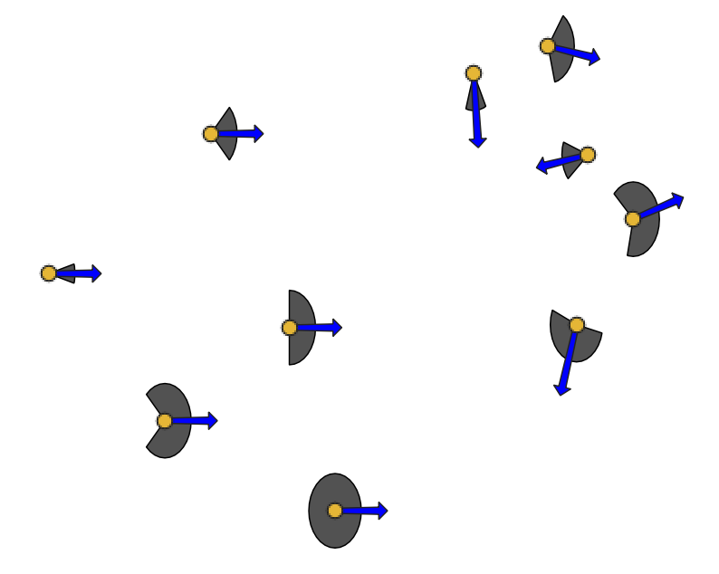

# Antenna fans in QGIS 3

Instructions for creating fans used to indicate the directionality of 
antennas, commonly used for symbolizing cell phone towers. This process uses 
geometry generators in QGIS 3.

Note: This process is based on [this work](https://gis.stackexchange.com/questions/181706/showing-antenna-symbols-on-the-map-point-symbols-or-features-polygons#233514), 
which was originally created for QGIS 2.

## Requirements

This symbology relies on having a point file with following fields with numeric 
values in degrees:

* azimuth
* beamwidth

It also relies on having two variables set (in layer units):

* antenna_fan_arrow_length
* antenna_fan_radius

In the example below these are set on the layer, but they can be set at the 
project level as well.

## Instructions

Detailed instructions for creating the symbology can be found in the 
[instructions](instructions.md) file.

If you just want to use the QGIS style file, it can be found 
[here](style/qgis_antenna_fan_symbol.qml).